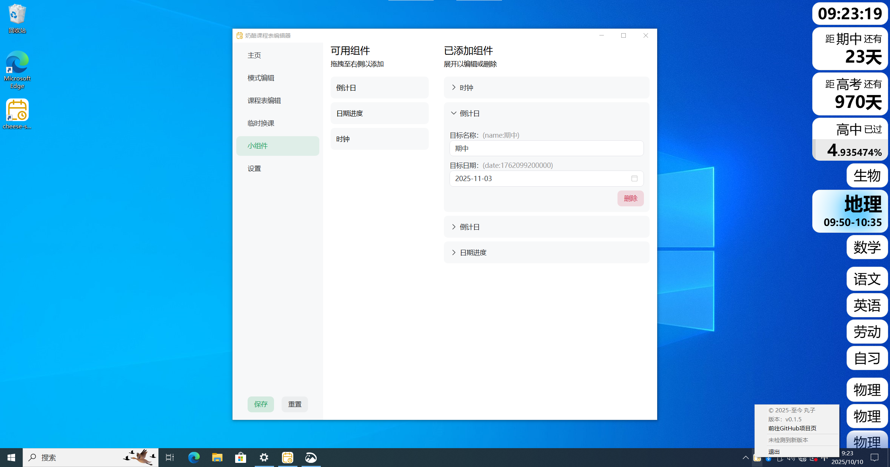

# 🧀奶酪课程表

该项目基于tauri + vite + vue开发

> 体积小巧，界面简洁

仅针对windows10/11进行了测试，windows7等系统无法正常使用。

## 功能

包括但不限于：

- [x] 时间模式编辑
- [x] 课程表编辑
- [x] 课程表显示（自动每日轮换）
- [x] 当日临时换课
- [x] 小组件（如：时钟、倒计日）

## 使用说明

- 程序运行时，会在系统托盘区显示一个图标，点击即可打开编辑器窗口
- 首次使用：
  1. 在`模式编辑`中配置时间模式（时间表）
  2. 在`课程表编辑`中选择每一天的`模式`
  3. 配置每一节课的`课程`
  4. 配置完成后点击`保存`即可
- 变更将在您点击`保存`后生效并存储到配置文件
- 配置文件全部存储在`应用安装目录`下的`config.json`文件中，可在`设置`中直接定位到该文件以进行导入导出

## 备注

tauri在构建时使用的版本号：

产品版本->Cargo.toml

文件版本->tauri.conf.json
