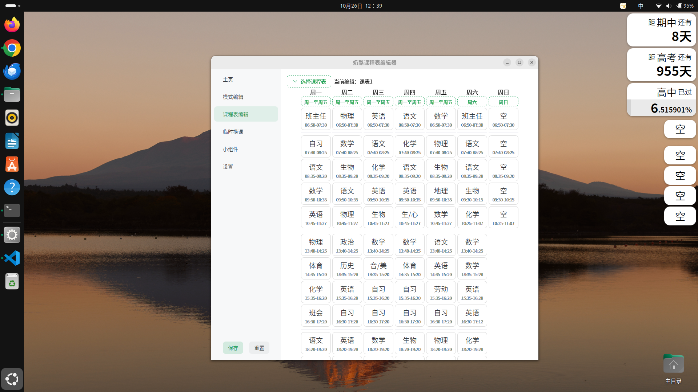

#  奶酪课程表

> 该项目目前正在参加“齐齐哈尔市中俄青少年人工智能创新大赛”，以这条信息证明该项目确实完全由参赛者所开发，且版权属于该参赛者所有。如有疑问，可前往issue中联系开发者（参赛者）确认身份。

奶酪课程表是一款简洁的教室大屏电子课表软件，基于tauri + vite + vue开发，相较同类软件，该软件简单易懂，资源占用轻量。

| 软件                 | 包体积 | 内存占用 |
| -------------------- | ------ | -------- |
| 奶酪课程表           | <10MB  | ≈150MB   |

得益于tauri2的跨平台特性，程序也实验性支持linux和macos系统，可自行编译体验。

## 功能

### 课表

- [x] 时间模式编辑
- [x] 课程表编辑
- [x] 图片导入（AI驱动）
- [x] 多周轮换
- [x] 课程表每日自动轮换显示
- [x] 当日临时换课
- [x] 时间偏移
- [x] 上下课语音提醒（AI TTS）
- [x] 窗口上下课自动置顶置底

### 小组件

- [x] 时钟
- [x] 倒计日
- [x] 日期进度
- [x] 出席人数（需要搭配[请假服务器](https://github.com/xwzkj/leaveServer)使用，请自行搭建后端服务）
- [x] 每日单词（AI驱动）

### 随机抽选（抽签）

- [x] 快捷键触发
- [x] 悬浮按钮
- [x] 动态概率（根据抽签历史动态调整）
- [x] 防止重复（轮次功能）
- [x] 课前自动开启新轮次
- [x] 排除请假者
- [x] 课间防作弊（课间抽选不计入历史记录）
- [x] 防娱乐（若抽签过快则延长冷却时间）

### 杂项

- [x] [通用课程表交换格式(CSES)](https://github.com/SmartTeachCN/CSES)导入导出
- [x] 配置文件导入导出（手动复制）
- [x] AI笔记（截屏总结）
- [x] 编辑器密码锁定
- [x] U盘密钥解锁
- [x] 按页面锁定
- [x] 新版本检测

### 自定义项

- [x] 缩放调节（主窗口）
- [x] 高度调节（主窗口）
- [x] 主题色

## 使用说明

- 程序运行时，会在系统托盘区显示一个图标，点击即可打开编辑器窗口，右键点击（触屏长按）可打开菜单，可于此进行软件更新等操作
- 首次使用：
  1. 在`模式编辑`中配置时间模式（时间表）
  2. 在`课程表编辑`中选择每一天的`模式`
  3. 配置每一节课的`课程` / 在`设置`配置AI API密钥后使用`从课程表图片导入`功能
  4. 配置完成后点击`保存`即可
- 变更将在您点击`保存`后生效并存储到配置文件
- 配置文件全部存储在`应用安装目录`下的`config.json`文件中，可在`设置`中直接定位到该文件以进行导入导出
- 程序默认为开机自启，若要关闭，请更改配置文件的`startup`字段为`false`，设置将在重启程序后生效

## 备注

### 关于Windows7等旧系统

奶酪课程表无法在此类系统正常运行。

1. 旧系统不支持新版本rust
2. 旧系统不支持新版webview2
3. 在win7使用拓展内核([VxKex](https://github.com/YuZhouRen86/VxKex-NEXT/releases/tag/1.1.3.1584))和webview2 109后可以正常启动，但主窗口透明效果失效，且该版本webview2无法正常渲染UnoCSS presetWind4预设的颜色

### 添加小组件（对于开发者）

需改动三处：

- 添加小组件本体：位于`src/component/widgets`目录下，是一个vue单文件组件
- 在小组件编辑页添加配置项：在`src/pages/editor-widget.vue`中的列表中添加新的配置对象
- 在主窗口添加解析：在`src/pages/mainWindow.vue`导入小组件本体，并在`getWidgetComponent`函数添加新的分支

### 关于贡献

该项目暂时作为个人项目，暂不接受PR。

欢迎提交issue

### 星标历史

