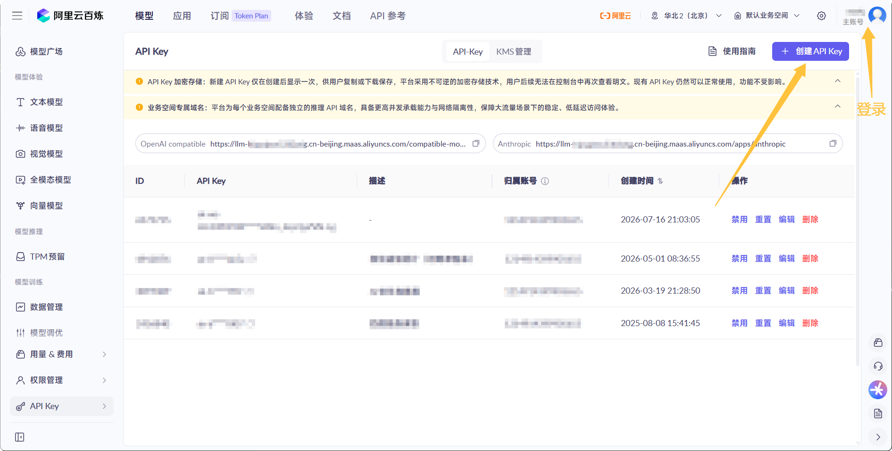
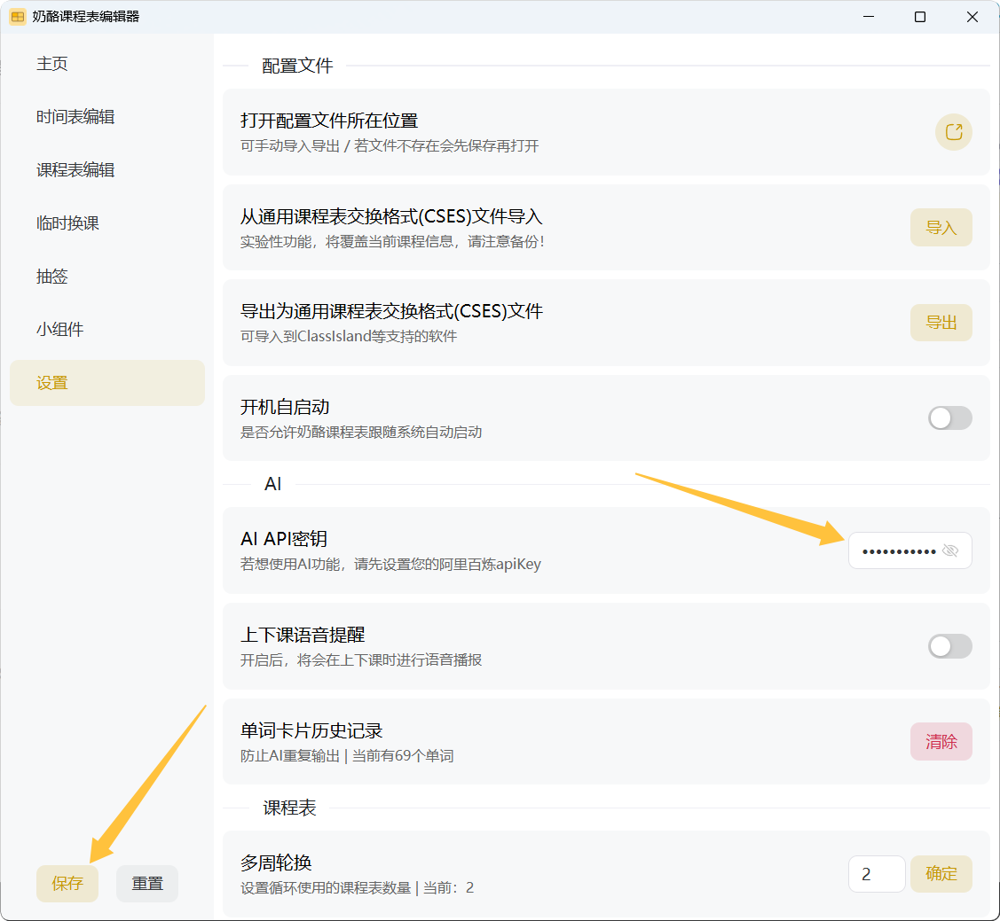

# AI功能

## 介绍

奶酪课程表的一些功能是由AI驱动的。

奶酪课程表目前选择阿里云百炼作为模型提供商。

在使用AI功能前，需要先在设置中填写`AI api密钥`。

::: danger 注意
AI功能需要消耗您在阿里云百炼的token，会消耗您的免费额度或者余额！计费请参考阿里云百炼官方说明。
:::

## 获取并配置api密钥

打开[阿里云百炼api-key页面](https://bailian.console.aliyun.com/cn-beijing/?tab=model#/api-key)，登录阿里云账号，按照指引创建并复制api密钥。

打开`设置`页面，在`AI api密钥`处粘贴您的密钥，然后保存。

## 测试

填写有效密钥后，即可使用AI驱动的功能。

您可以在小组件页面添加一个`每日单词`小组件，如果主窗口正常生成了单词，则说明配置正确。

## 功能列表

以下是需要使用AI能力的功能：

- 悬浮按钮 -> 笔记
- 小组件 -> 每日单词
- 设置 -> 上下课语音提醒
- 课程表编辑 -> 从课程表图片导入
- 小组件 -> 出席人数（可选AI能力：微信群自动同步）
