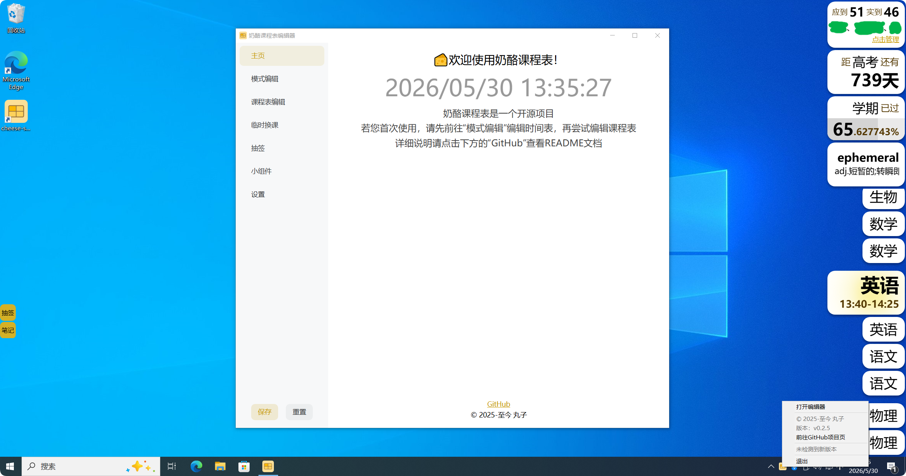

# 奶酪课程表

奶酪课程表是一款简洁的教室大屏电子课表软件，基于tauri + vite + vue开发，相较同类软件，该软件简单易懂，资源占用轻量。

| 软件                 | 包体积 | 内存占用     | 补充                                              |
| -------------------- | ------ | ------------ | ------------------------------------------------- |
| 奶酪课程表           | <10MB  | ≈150MB~250MB | 打开配置窗口后占用约250MB内存，关闭后恢复到≈150MB |
| 同类软件1            | ≈125MB | ≈165MB~250MB | 打开配置窗口后占用约250MB内存，关闭后不会减少     |
| 同类软件2(V1)        | ≈65MB  | >70MB        | 每打开配置窗口就会永久增加占用，可达几百MB        |
| 同类软件2(V2 测试版) | ≈185MB | >200MB       | 同V1                                              |

得益于tauri2的跨平台特性，程序也实验性支持linux和macos系统，可自行编译体验。

## 功能

### 课表

- 时间模式编辑
- 课程表编辑
- 图片导入（AI驱动）
- 多周轮换
- 课程表每日自动轮换显示
- 当日临时换课
- 时间偏移
- 上下课语音提醒（AI TTS）
- 窗口上下课自动置顶置底

### 小组件

- 时钟
- 倒计日
- 日期进度
- 出席人数（需要搭配[请假服务器](https://github.com/xwzkj/leaveServer)使用，请自行搭建后端服务）
- 每日单词（AI驱动）

### 随机抽选（抽签）

- 快捷键触发
- 悬浮按钮
- 动态概率（根据抽签历史动态调整）
- 防止重复（轮次功能）
- 课前自动开启新轮次
- 排除请假者
- 课间防作弊（课间抽选不计入历史记录）
- 防娱乐（若抽签过快则延长冷却时间）

### 杂项

- [通用课程表交换格式(CSES)](https://github.com/SmartTeachCN/CSES)导入导出
- 配置文件导入导出（手动复制）
- AI笔记（截屏总结）
- 编辑器密码锁定
- U盘密钥解锁
- 按页面锁定
- 新版本检测

### 自定义项

- 缩放调节（主窗口）
- 高度调节（主窗口）
- 主题色