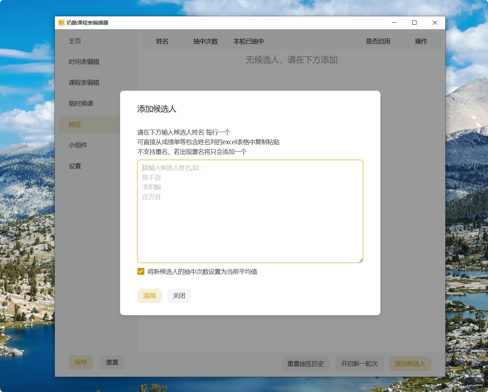
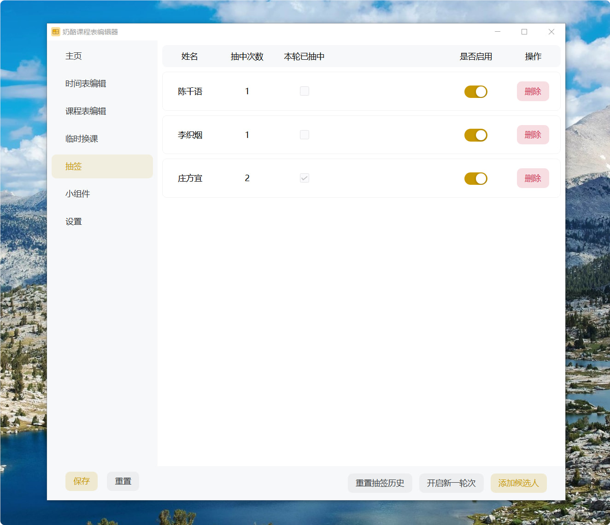
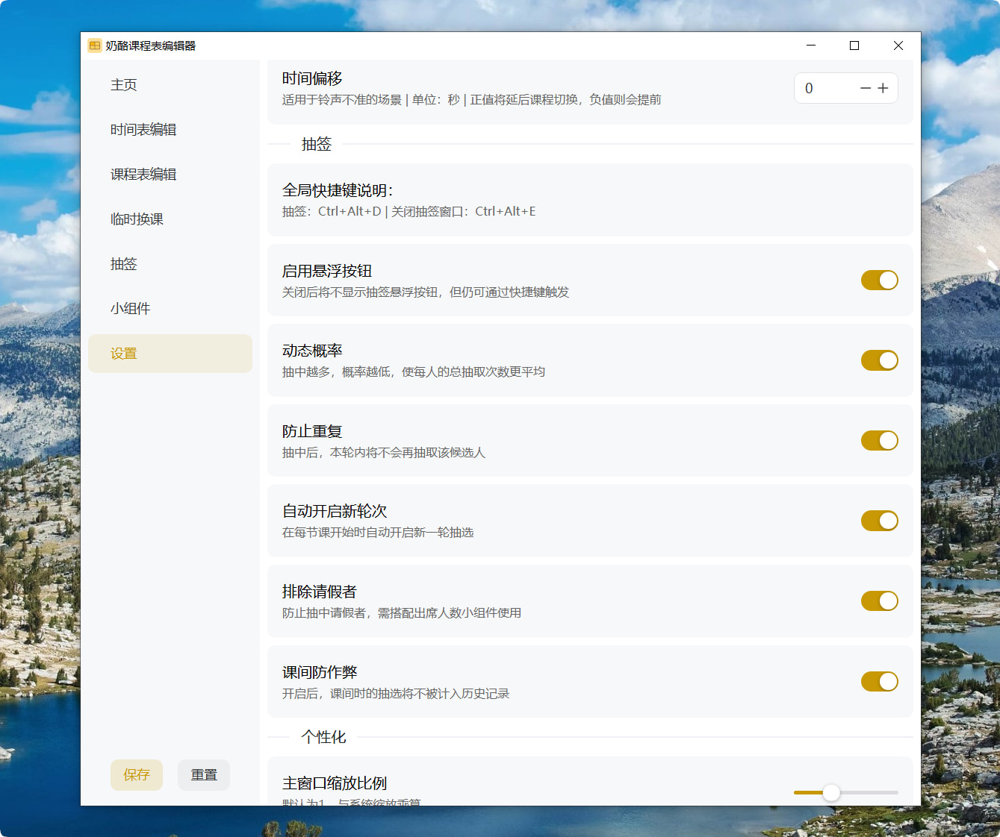
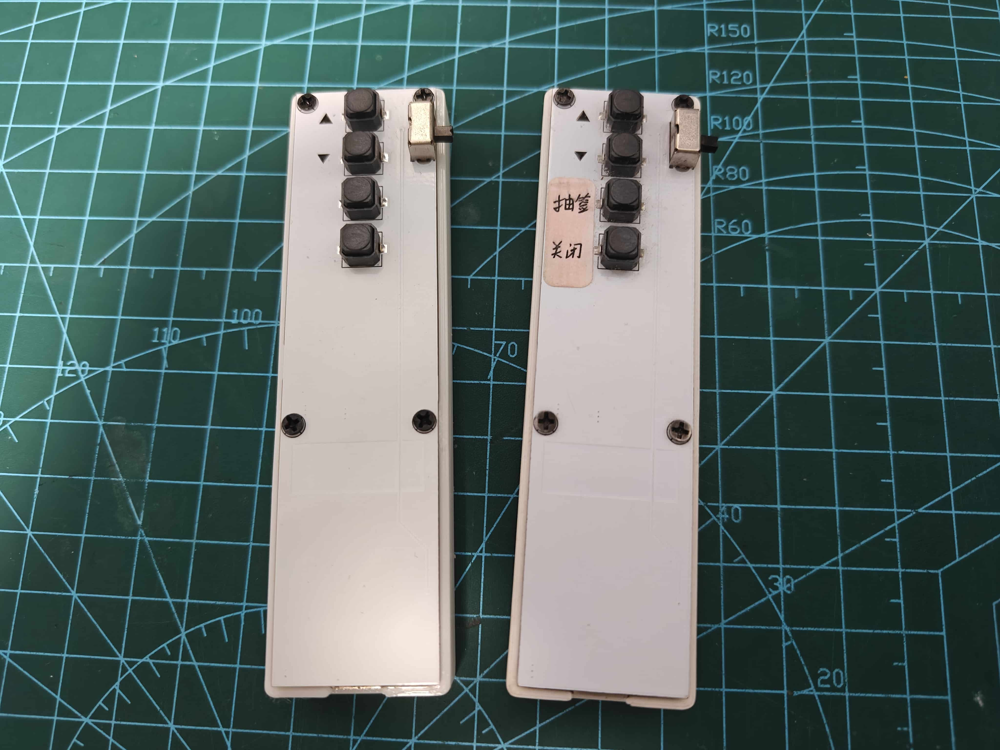

# 随机抽选：抽签

## 介绍

抽签功能是奶酪课程表的内置功能，开箱即用。

它简单易用，支持多种功能选项，为教学提供公平的随机提问支持。

## 快速开始

首先点击软件托盘图标，打开`编辑器窗口`，进入`抽签`页面，点击`添加候选人`：



在编辑框内输入希望添加的候选人的姓名，每行输入一个，重名将会被滤除。示例：

``` plain
陈千语
李织烟
庄方宜
```

界面说明：



1. 姓名：候选人姓名
2. 抽中次数：该候选人被抽中的总次数
3. 本轮已抽中：指示该候选人在本轮次中是否已被抽中
4. 是否启用：关闭后将禁用该候选人，不会被抽中
5. 删除：删除该候选人
6. 重置抽签历史：清除所有候选人的抽中次数
7. 开启新一轮次：手动开启新一轮抽签

在完成候选人的添加后，点击屏幕左侧悬浮的`抽签`按钮或按下`Ctrl+Alt+D`，即可快速进行抽签。


## 功能选项

进入`设置`页面，滚动到`抽签`设置区域



接下来我将逐一介绍这些功能选项。

### 快捷键

按下软件显示的快捷键即可快速触发/关闭抽签，暂不支持自定义。

> 如果需要自定义快捷键，请提issue。

该功能可以与我设计的蓝牙翻页笔配合使用，实现远程抽签。

翻页笔使用zmk固件，采用Promicro NRF52840作为主控，搭配800mAh锂电池可实现超过一个月的续航。

> 这个翻页笔的复刻教程待补充



### 悬浮按钮

屏幕左侧的`抽签` `笔记`按钮。可以用此开关控制显示/隐藏。

> 暂不支持自定义位置，可以提issue。

### 动态概率

抽签系统支持启用`动态概率`，启用后每次抽签将不再使用简单随机抽样抽取，而是根据每位候选人的历史抽中次数动态计算抽中概率，对于单一候选人来说，抽中越多、概率越低。

该功能可以显著降低教学场景中候选人之间抽中次数的波动，经测试，可将方差降至个位数水平。

公式(n是该候选人的抽中次数)：
$$
权重 = \frac{1}{n+1}
$$

### 防止重复

开启后，在抽签系统里引入`轮次`概念，相当于不放回签筒的抽签。

当本轮次中没有剩余候选人时，再次抽选将会自动开启新一轮次。

### 自动开启新轮次

在每节课上课时自动开启新轮次。

### 排除请假者

与`出席人数`小组件联动，当存在请假者时，自动将其从候选列表排除。

### 课间防作弊

将在课间产生的抽选结果视为娱乐行为，不计入历史记录，防止影响公平性。
