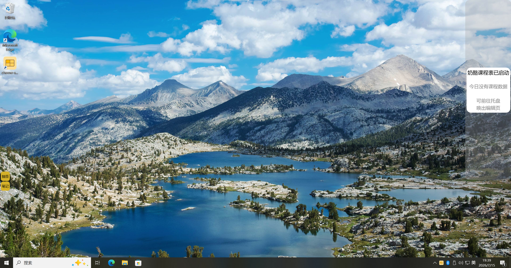
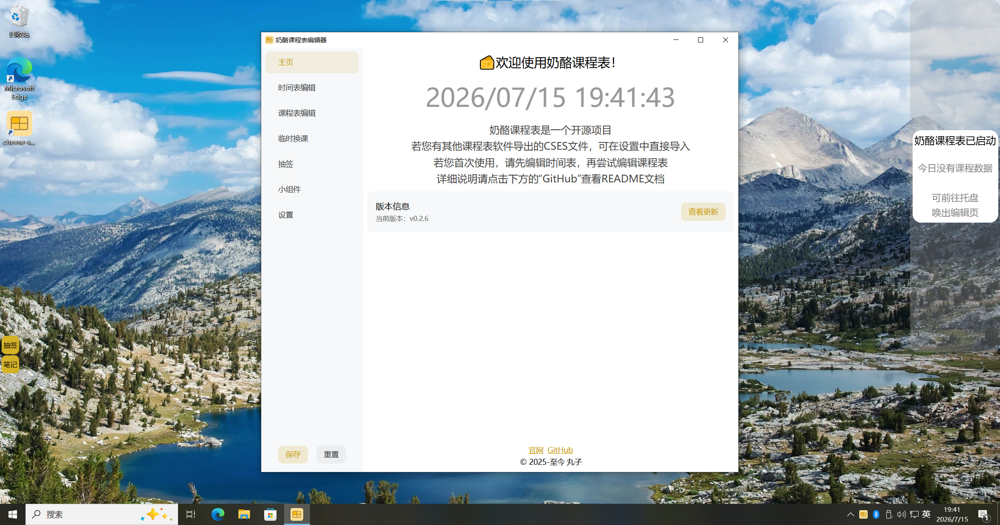
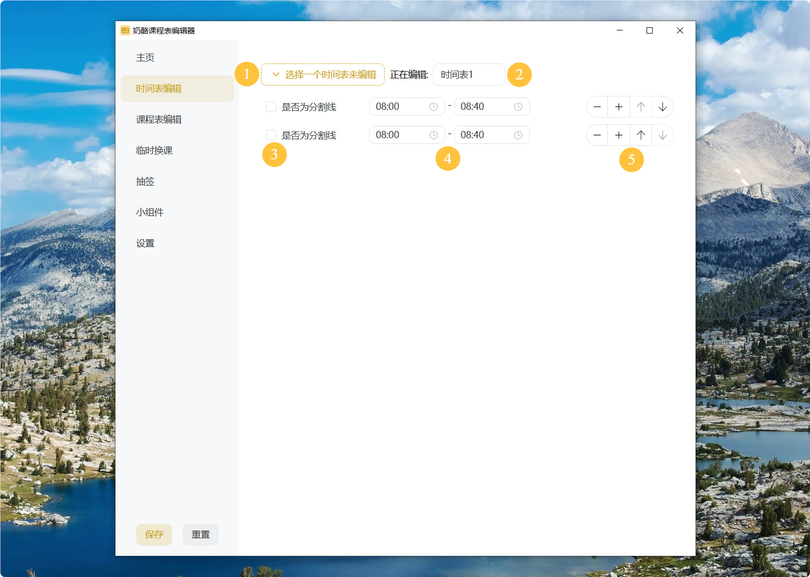
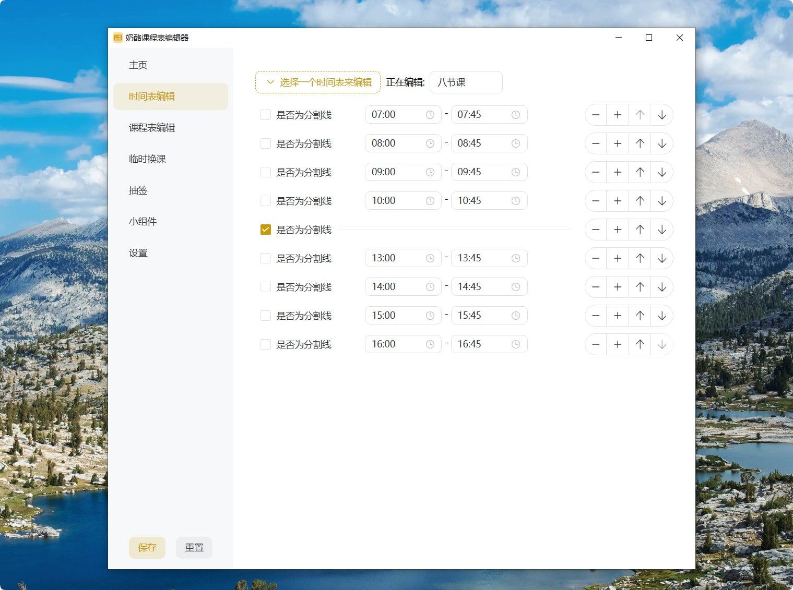
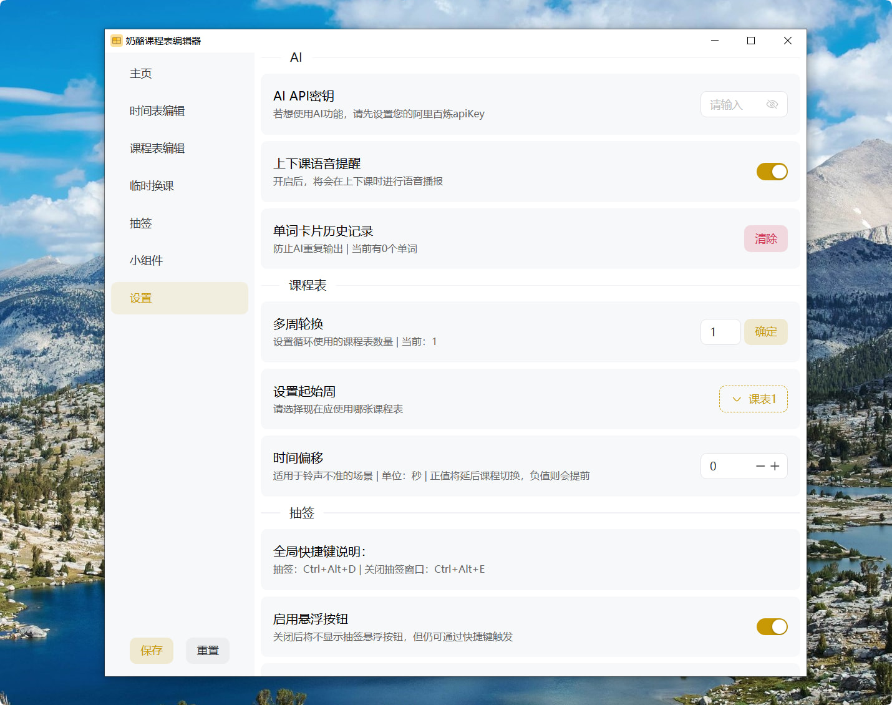
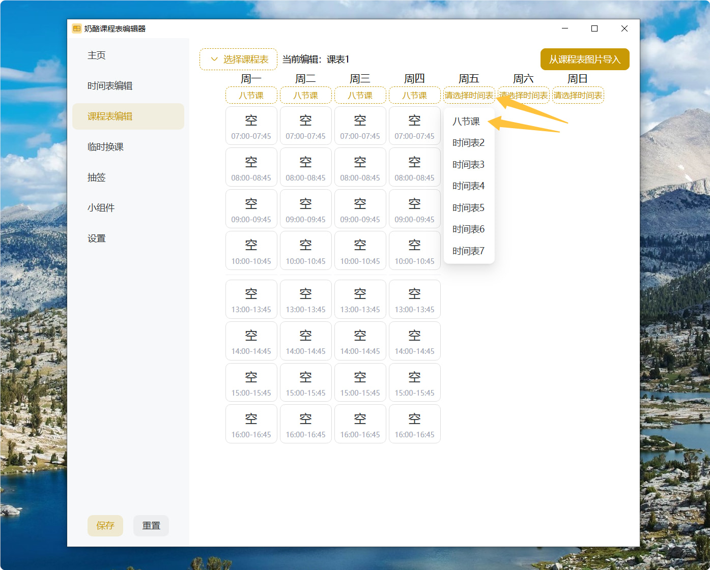
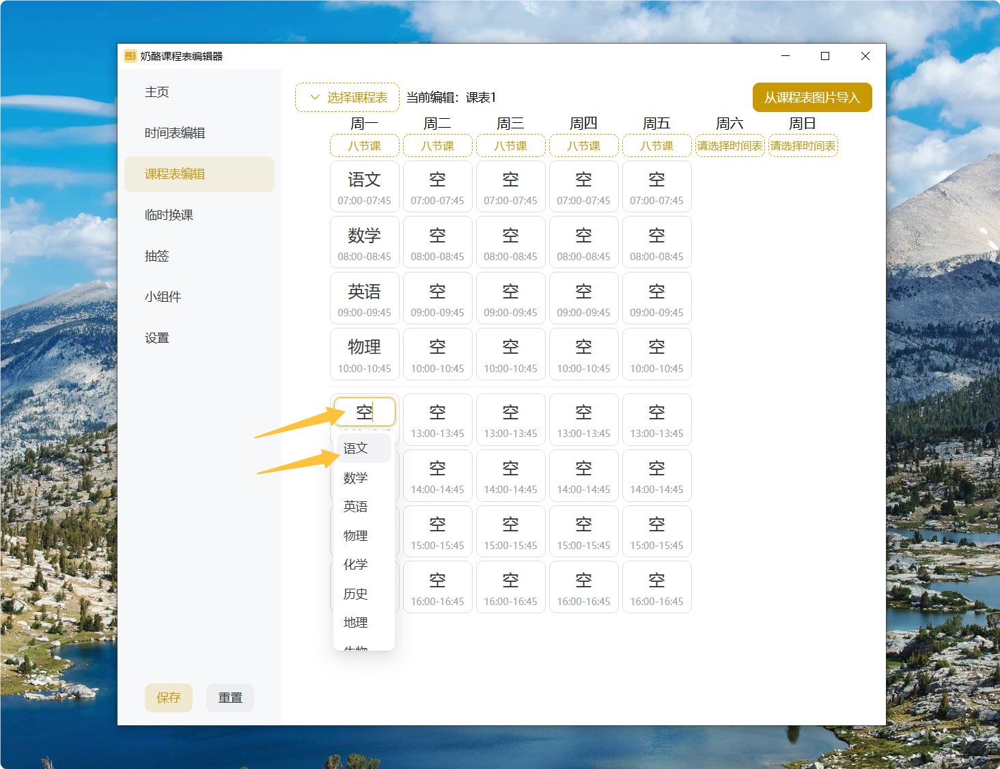
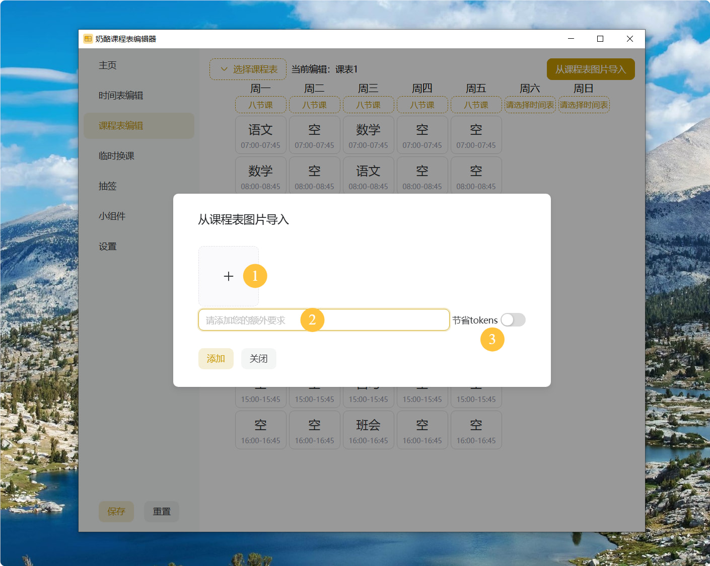
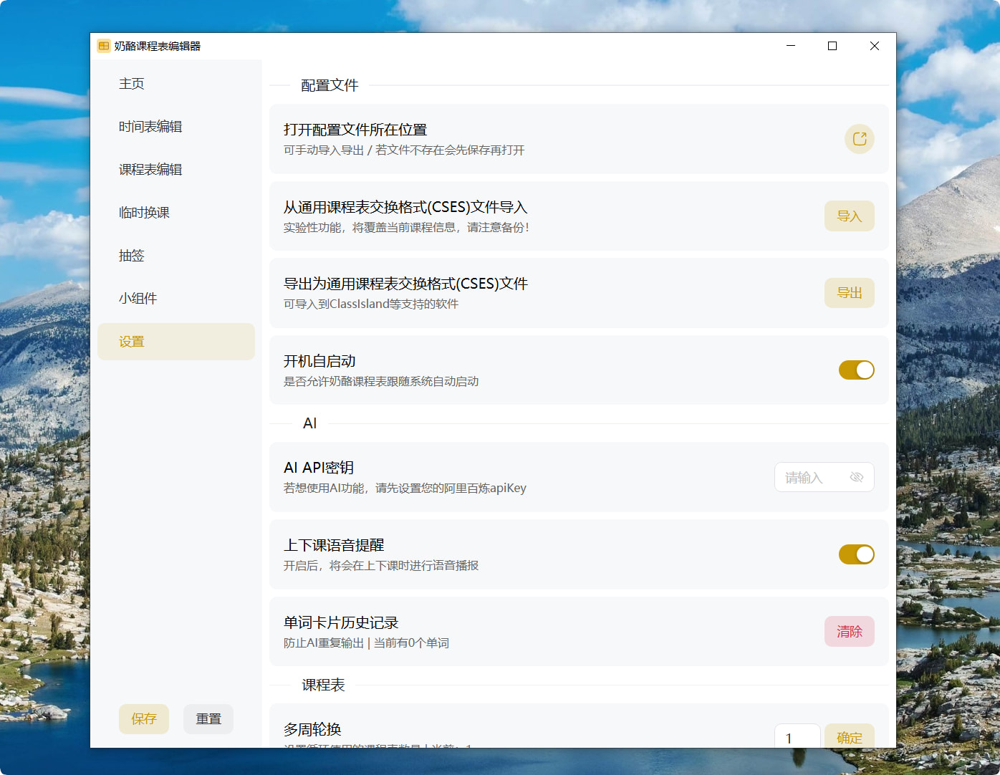
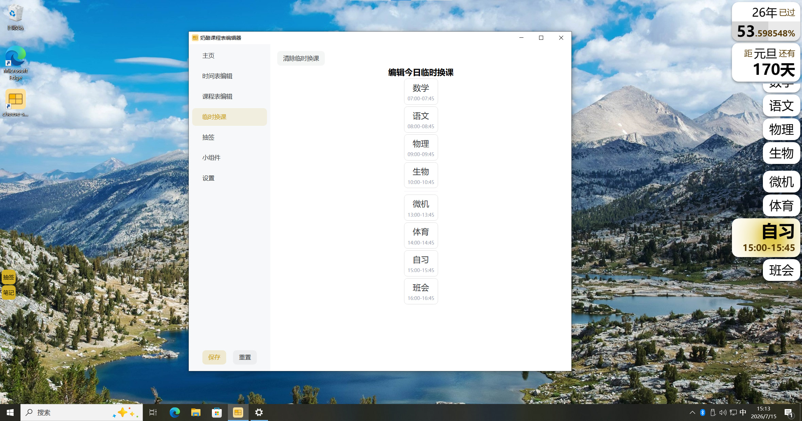

# 初次使用

恭喜你已经完成了奶酪课程表的安装！

软件首次启动会在屏幕右侧显示提示窗口,在左侧显示悬浮按钮,并在系统托盘显示托盘图标。

若想开始使用本软件，请左键单击软件托盘图标以打开编辑器。

编辑器的左侧是导航栏，右侧是编辑区域。

::: tip 很重要的事
在对配置进行修改后，千万不要忘了点击`保存`按钮。
:::

首次使用，你有几种选择：

- 全新开始
- 使用`CSES`（通用课程表交换格式）文件导入
- 使用已有的`奶酪课程表`配置文件

## 全新开始

你可以直接使用该编辑器创建一个全新的课程表数据。

### 编辑时间表

在编辑课程数据前，你需要先进入`时间表编辑`页面，创建每节课程对应的时间槽位，用于后续设置课程。

进入`时间表编辑`页面，点击`添加时间安排`即可新增第一个时间槽位。

界面说明：

1. 时间表选择：从多个时间表中选择一个进行编辑。目前软件支持7个时间表，一般用不了这么多。
2. 时间表名称修改：修改当前正在编辑的时间表名称。
3. 是否为分割线：勾选后当前时间槽位则不再代表课程，而是作为分割线。
4. 槽位起止时间：设置当前时间槽位的起止时间。
5. 控制按钮：
   1. 删除当前时间槽位
   2. 在当前槽位下方新增一个时间槽位
   3. 上移当前槽位
   4. 下移当前槽位

循环往复，直到编辑完成。

### 编辑课程表

奶酪课程表支持多周轮换课表，如果你的学校采用大小周等制度，可以前往`设置`页面，对多周轮换进行配置。

设置结束后进入`课程表编辑`页面，如果启用了多周轮换，先在左上角选择想要编辑的课程表。

在填充课程前，需要先选择这天所使用的时间表：

选择完成后，在下方出现的槽位填充这节课对应的课程：

> 你可以直接在弹出的候选栏中点击选择，也可以手动输入课程名称。课程名称长度限制为三个汉字。

其实在这里，**选择完时间表后**，可以点击右上角的`从课程表图片导入`按钮，使用AI导入功能自动填充课表：

1. 在设置中填写大模型的API密钥（文档待补充）
2. 点击`从课程表图片导入`按钮，选择课程表图片，开始导入
3. 等待AI处理完成，课程表将会自动填充。

界面说明：

1. 点这里选择课程表图片
2. 在这里输入额外需求，将会发送给AI
3. 节省token：开启后，将会限制AI的思维链长度，节省token消耗和时间

## 使用CSES文件导入

CSES是在国内开源课程表生态中的通用格式，奶酪课程表同时支持该格式的导入导出。

你可以进入`设置`页面，对CSES文件进行导入导出。

这个功能使用起来很简单，不再详细说明

> 请核对后再点击`保存`，不点击保存不会生效，也不会覆盖原配置

## 使用已有的配置文件

如果你之前使用过该软件，拥有可用的配置文件`config.json`，则适用于这一方法。

进入`设置`页面，执行`打开配置文件所在位置`，将定位到的`config.json`文件替换为你的配置文件，然后重启软件即可。

## 开始使用

在编辑并保存课程表后，现在可以正式开始使用本软件了。

告诉你个很实用的功能：临时换课

你可以在`临时换课`页面对今天的课程进行临时调整，不会影响你的课程表数据！

在这张图片你可以看见右侧的主窗口已经显示了今天的课程表。

主窗口分为两个区域：

1. 上方的小组件区域：显示你自定义的小组件
2. 下方的课程表区域：显示今天的课程表
   - 现在是这节课课前：卡片展开、背景较浅
   - 现在是这节课课上：卡片展开、背景较深
   - 现在不是这节课：卡片收起

### 存在问题？

软件在开发时很少会以全新安装的状态进行测试，所以确实可能在首次使用时会出现问题。

如果软件存在问题，请前往[GitHub Issues](https://github.com/yourusername/CheeseSchedule/issues)提交问题或者加入[QQ群聊](../other/group.md)反馈。
