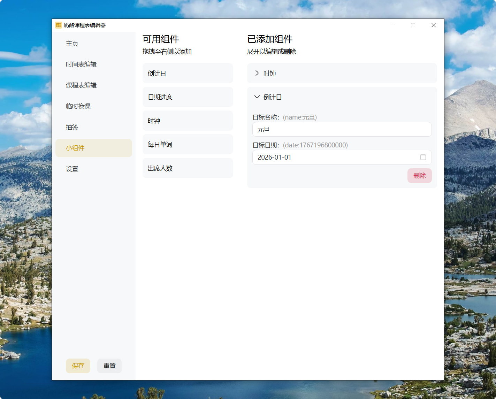
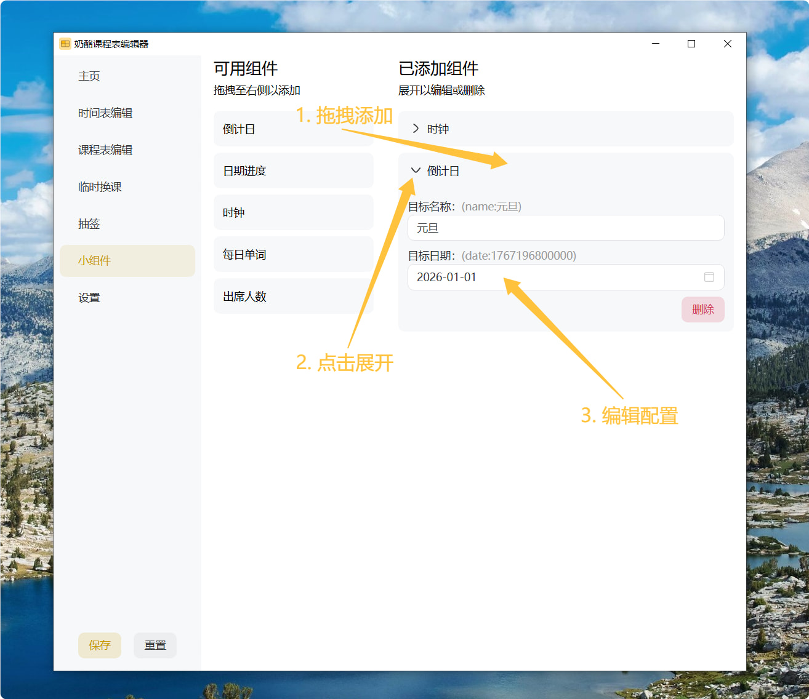
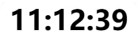
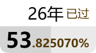
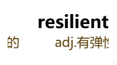
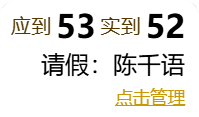

# 小组件

## 介绍

奶酪课程表内置多种实用的小组件，可以按照你的喜好随心搭配使用

目前，奶酪课程表不支持插件系统，不支持导入自定义小组件。

## 基本使用

`小组件`页面分为两栏，左侧为可用小组件，右侧为已添加小组件。

小组件通过拖拽的方法添加，你可以把想添加的小组件拖拽至右侧，也可以在右侧拖拽调整顺序。

但是对于删除操作，你需要展开编辑面板，点击`删除`按钮。

对于大部分小组件，添加后需要进行配置才能正常工作。

点击已添加组件左侧的箭头图标，即可展开编辑面板。

## 配置项

接下来详细介绍每个小组件的配置项如何使用。

### 时钟

显示当前时间

{.widget}

无配置项。

### 倒计日

显示今天距离某活动的天数

{.widget}

| 配置项   | 描述                               |
| -------- | ---------------------------------- |
| 目标名称 | 这个活动的名称，将在小组件直接显示 |
| 目标日期 | 这个活动在哪天                     |

### 日期进度

实时显示当前某个活动的时间进度百分比

{.widget}

| 配置项   | 描述                               |
| -------- | ---------------------------------- |
| 目标名称 | 这个活动的名称，将在小组件直接显示 |
| 开始日期 | 这个活动从哪天开始                 |
| 结束日期 | 这个活动到哪天结束                 |

### 每日单词

AI驱动单词小组件，每次软件启动时自动生成一个新单词

> 需要先设置大模型api密钥才能使用，见[AI功能](../advanced/AI.md)

{.widget}

| 配置项       | 描述                         |
| ------------ | ---------------------------- |
| 对单词的要求 | 作为提示词的一部分，发送给AI |

### 出席人数

显示班级的出席人数信息，每分钟刷新

> 需自行搭建服务端，见[出席人数](../advanced/attendance.md)

{.widget}

| 配置项      | 描述                    |
| ----------- | ----------------------- |
| api接口地址 | 请假服务器的api接口地址 |
| api密钥     | 接口密钥                |
