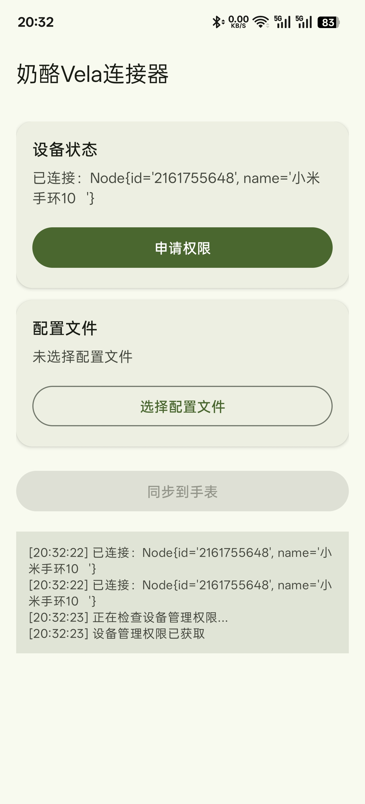

<!-- markdownlint-disable MD033 -->
# 奶酪课程表手环版

[米坛社区资源链接](https://www.bandbbs.cn/resources/6843/)

## 介绍

这是奶酪课程表的腕上形态，是为小米vela系统编写的课程表快应用软件，兼容电脑版奶酪课程表的配置文件，支持其核心功能，同时支持CSES文件导入

电脑版由人类开发，但手环版使用vibe coding方式开发。

## 功能

- 查看时间日期
- 查看当日课程
- 查看当前课程及课程状态
- 查看距离下课/下节课上课的时间
- 查看整张课程表的课程信息
- 多周轮换课表
- 使用手机上传课表
- ...

## 使用前须知

该软件**理论上**可在所有小米vela系统的手环手表中运行，但仅在几款型号中被实机测试。

已测试的型号：

- 小米手环10
- 小米手环9pro
- 小米手环10pro

软件针对小米手环10的跑道屏开发，在pro型号中，软件布局可能比较浪费屏幕空间。

## 1.下载与安装

::: danger 注意
下载时请选择`123云盘`，`GitHub`中只有电脑版
:::

[下载中心](./download)

首先，下载手环快应用`.rpk`文件，使用`表盘自定义工具`或`AstroBox`为手环安装。

然后，下载`奶酪Vela连接器`apk文件，在装有`小米运动健康`并连接至手环的手机安装。

{width=300px}

## 2.获取课表文件

手机同步器现在只能通过配置文件导入手环，不支持生成和编辑配置，所以你需要先获取配置文件。

如果你有电脑，推荐安装电脑版`奶酪课程表`软件，获得最佳的体验（对应下文[json配置文件](#json配置文件)）

如果你只有手机，可以选择CSES文件导入（对应下文[CSES文件](#cses文件)）

### json配置文件

> 这是电脑版奶酪课程表的配置文件，软件原生支持的格式，兼容性最好

在电脑版`奶酪课程表`中，点击托盘图标打开编辑器，点击`设置`，点击`打开配置文件所在位置`，定位到的文件就是想要的`.json`配置文件。

### CSES文件

> 软件会将其自动转为`.json`配置文件使用，CSES格式文件不支持课程分隔线

您可以使用`奶酪课程表`或者`ClassIsland`等电脑课表软件导出该文件。

除此之外，您也可以使用[该网页](https://cloud.smart-teach.cn/)在线生成和编辑CSES文件，该方式**同时支持电脑和手机**。（**该网页为第三方页面，其内容和观点与本站无关**）

:::info 提示
请**在应用商店**下载`Edge`浏览器或者`Google Chrome`浏览器（谷歌浏览器）打开此网站（别去百度下载！）

其他浏览器可能有杂七杂八的问题...你要是觉得没问题也可以用

进入网站后网站选择“以本地模式继续”就可以，使用方法请自行探索，一般先填写`时间表`和`科目`，然后在`课程表`页面快速填充，为课程表选择时间表，再填充课程。

一切编辑完毕后，点击右上角蓝色按钮导出yml文件
:::

### 默认课表配置

如果您想快速体验软件功能，看看软件是否符合需求，可以点击<Badge text="i" type="warning" />图标进入关于页面，点击`使用默认课表`，然后重启软件，即可使用默认课表对软件快速体验。

## 3.同步到手环

在手环打开`奶酪课程表`，在手机打开`奶酪Vela连接器`：

1. 点击`申请权限`，应提示`权限已授予`
2. 点击`选择配置文件`，选择`奶酪课程表`的`.json`配置文件或者`CSES`的`.yml`/`.yaml`文件
3. 点击`同步到手表`
4. 手表显示`配置已更新，请重启软件`后，重启手表端`奶酪课程表`软件即可

## 使用说明

## 交流

不管是有问题需要帮助，还是没问题进来闲聊，都欢迎加入奶酪课程表交流群，群号可以在站内找到。
