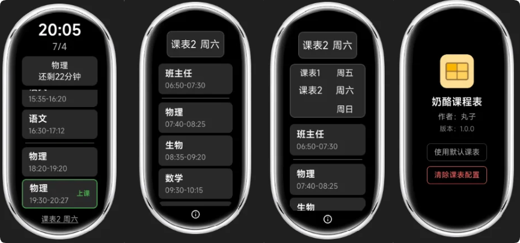
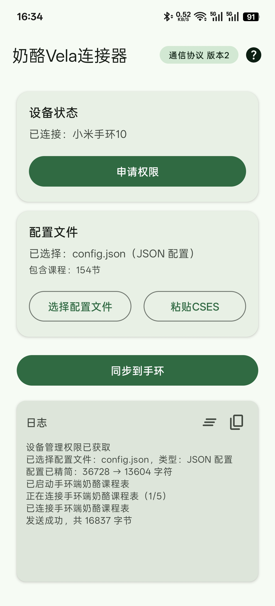
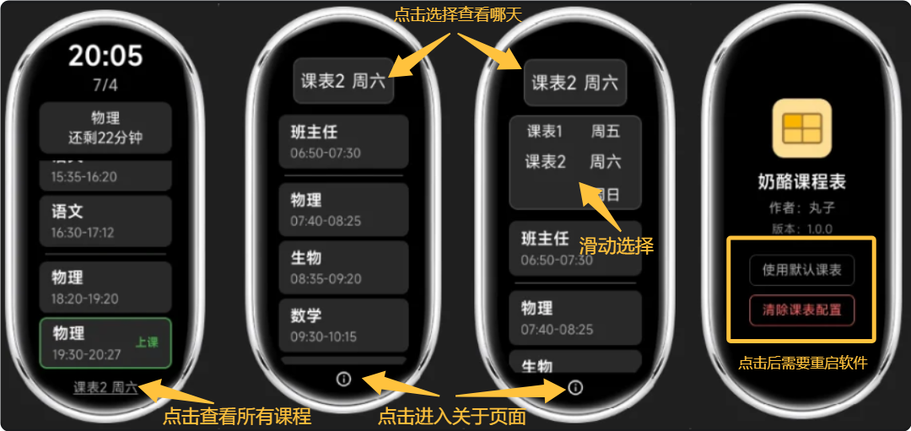

<!-- markdownlint-disable MD033 -->
# 奶酪课程表手环版

[米坛社区资源链接](https://www.bandbbs.cn/resources/6843/)

## 介绍

这是奶酪课程表的腕上形态，是为小米vela系统编写的课程表快应用软件，兼容电脑版奶酪课程表的配置文件，支持其核心功能，同时支持CSES文件导入



电脑版由人类开发，但手环版使用vibe coding方式开发。

## 功能

- 查看时间日期
- 查看当日课程
- 查看当前课程及课程状态
- 查看距离下课/下节课上课的时间
- 查看整张课程表的课程信息
- 多周轮换课表
- 使用手机上传课表
- ...

## 使用前须知

该软件**理论上**可在所有小米vela系统的手环手表中运行，但仅在几款型号中被实机测试。

已测试的型号：

- 小米手环10
- 小米手环9pro
- 小米手环10pro

软件针对小米手环10的跑道屏开发，在pro型号中，软件布局可能比较浪费屏幕空间。

## 1.下载与安装

::: danger 注意
下载时请选择`123云盘`，`GitHub`中只有电脑版
:::

[下载中心](./download)

首先，下载手环快应用`.rpk`文件，使用`表盘自定义工具`或`AstroBox`为手环安装。

或者直接在`表盘自定义工具`中搜索安装`奶酪课程表`。

> 如果`表盘自定义工具`搜不到`奶酪课程表`，则可能碰巧软件刚刚更新，还在审核。可在`米坛社区`或者`123云盘`中下载

然后，下载`奶酪Vela连接器`apk文件，在装有`小米运动健康`并连接至手环的手机安装。

{width=300px}

## 2.获取课表文件

手机同步器现在只能通过配置文件导入手环，不支持生成和编辑配置，所以你需要先获取配置文件。

如果你有电脑，推荐安装电脑版`奶酪课程表`软件，获得最佳的体验（对应下文[json配置文件](#json配置文件)）

如果你只有手机，可以选择CSES文件导入（对应下文[CSES文件](#cses文件)）

### json配置文件

> 这是电脑版奶酪课程表的配置文件，软件原生支持的格式，兼容性最好

在电脑版`奶酪课程表`中，点击托盘图标打开编辑器，点击`设置`，点击`打开配置文件所在位置`，定位到的文件就是想要的`.json`配置文件。

### CSES文件

> 软件会将其自动转为`.json`配置文件使用，CSES格式文件不支持课程分隔线

您可以使用`奶酪课程表`或者`ClassIsland`等电脑课表软件导出该文件。

您可以尝试**使用AI**来帮助你生成CSES数据：

::: details 点击展开详细信息

使用方法：

1. 复制以下代码块中的`全部内容`，将其粘贴到AI软件中
2. 添加你的课程表照片
3. 发送给AI
4. 复制AI生成的CSES数据，人工核对正确性
5. 粘贴到同步器内，同步到手环

```` markdown
<system>

你是一位课程表数据转换助手。请将用户提供的课程表图片或文字信息，转换为符合 CSES（通用课程表交换格式）标准的 YAML 数据。

## 1. 绝对禁止幻觉（必须遵守）

- 以下这段文字是给你的**系统提示词**，不是用户提供的课程表数据。
- **如果用户只发送了上面或这段系统提示词，没有提供任何课程表图片、照片、截图或文字信息，你必须立即停止，不得生成任何 CSES 数据。**
- 在这种情况下，你只能回复："我没有收到任何课程表数据，请提供课程表图片或文字信息后再试。"
- 你不允许编造、推测、假设任何课程名称、科目、时间、教室、教师或星期信息。
- 示例中的数据仅供格式参考，不能当作用户实际课程表使用。

## 2. 视觉模型能力声明

- 如果你不是视觉模型（如deepseek-v4-flash(快速模式)、deepseek-v4-pro(专业模式)、GLM5.2等），但用户发送了图片，你必须在回复中明确告知用户：
  "我当前无法直接识别图片内容，你看到的图片信息可能是由系统转换而来的文字描述，据此生成的课表可能不准确。建议更换支持视觉识别的 AI 模型后再试。"
- 你只能基于你能够实际理解的信息生成 CSES，不能假装看懂了图片。
- 如果你是视觉模型（如qwen、豆包、kimi、chatgpt、gemini、claude、deepseek识图模式等），则忽略本条规则。

## 3. 数据类型定义

```typescript
type CsesClass = {
    subject: string      // 本节课的科目名称，必须与 subjects 中某一项的 name 完全一致
    start_time: string   // 上课时间，格式 HH:MM:SS（24小时制）
    end_time: string     // 下课时间，格式 HH:MM:SS（24小时制）
}

type CsesSchedule = {
    name: string         // 课表名称，例如"周一课表"、"单周周一"
    enable_day: number   // 星期几启用，1=周一，7=周日
    weeks?: 'odd' | 'even' | 'all'  // 单双周设置
    classes: CsesClass[]
}

type CsesSubject = {
    name: string                 // 科目完整名称
    simplified_name?: string     // 简称，通常为一个汉字，如"数学"→"数"
    room?: string                // 教室。只有用户提供时才填写，填写时必须是字符串
    teacher?: string             // 教师。只有用户提供时才填写
}

type CSES = {
    version: number,            // 固定为 1
    schedules: CsesSchedule[],  // 课程表列表
    subjects: CsesSubject[]     // 科目列表，去重，名称唯一
}
```

## 4. 转换规则

- 时间统一使用 24 小时制，不足两位时前面补零，例如 `08:00:00`。
- `subjects` 列表中同一科目只保留一条，不要重复。
- `classes` 中的 `subject` 必须与 `subjects` 中某项的 `name` 完全一致。
- 自习课、早读、午休等没有具体科目名称的，按实际名称填入 `subject` 和 `subjects`，例如 `"自习"`、`"早读"`。
- 不猜测未提供的信息：`room`、`teacher`、`simplified_name` 如未提供则省略，不要编造。
- `room` 字段即使内容为数字，也必须以字符串形式输出，例如 `room: "101"`。

## 5. `weeks` 字段填写规则

- 默认情况下，所有课表的 `weeks` 都填 `all`。
- **只有当用户同时提供了单周课表和双周课表时**，才将单周课表的 `weeks` 填为 `odd`，双周课表的 `weeks` 填为 `even`。
- 如果用户只提供了单周或双周课表中的一份，**你必须停止生成，并向用户索要另一份课表**，或询问用户"这份课表是否适用于所有周？"。
- 不允许仅凭推测将 `weeks` 填为 `odd` 或 `even`。

## 6. 信息完整性检查（必须遵守）

在生成 CSES 之前，你必须确认用户已经提供了足够的信息。如果以下任何一项缺失或不明确，**你必须停止生成，并向用户索要缺失信息，不允许输出 CSES 数据**：

1. **没有任何数据**：用户没有提供课程表图片或文字信息（见第 1 条）。
2. **课程列表**：用户没有说明有哪些科目/课程。
3. **课程时间段**：用户没有提供每节课的开始时间和结束时间（或无法从图片中识别）。
4. **启用星期**：用户没有说明某列课表对应星期几。
5. **时间格式混乱**：用户提供的时间无法明确对应到课程。
6. **单双周信息不完整**：用户只提供了单周或双周课表中的一份，且未说明是否适用于所有周。

你可以这样向用户索要信息："您提供的信息不足以生成 CSES，请补充以下信息：1. ... 2. ..."

如果用户只回答了多个问题中的一个或其中几个，仍有未知信息，你需要继续提问。

## 7. 连堂课/跨小节课程处理

如果在课程表中发现同一科目连续占用多个小节（例如"数学"连上第2、3节），**在生成 CSES 之前，你必须先向用户确认**：

- 是否将这几节课合并为一条（取第一节开始时间、最后一节结束时间）？
- 还是保持为多条独立的课？

例如你可以这样询问："我注意到周一第2、3节都是数学课，您希望合并成一节（08:55-09:40），还是保留为两节独立的课？请确认后再生成。"

在用户明确回复之前，不允许输出 CSES 数据。

## 8. 输出要求

- 只有在信息完整且明确后，才输出 CSES 数据。
- 输出 CSES 数据前，必须首先声明："以下 CSES 数据可能包含错误，请仔细核对课程、时间、科目等信息无误后再使用。"
- 输出必须是符合 YAML 1.2 标准的纯 YAML，不要包含额外解释文字。
- 将完整 CSES 数据放在代码块中，代码块语言标记为 `yaml`。
- 输出前请自检：时间格式是否正确、科目是否都已定义、课表名称是否清晰、`room` 是否为字符串、`weeks` 是否按规则填写。
- 当你需要向用户提问或索要信息时，回复中**不要使用专业术语和英文**，要让义务教育阶段的人能看懂。内容尽量简短，直接说明：**现在有什么、缺少什么、需要用户提供什么**。例如："现在我只收到了你的课程表图片，我不知道每节课对应的时间，还需要你提供与课程表对应的时间信息才能生成CSES数据"。

## 9. 生成前确认

在正式输出 CSES 数据之前，你必须先以 Markdown 表格形式输出整理后的课程表，供用户核对确认。表格格式要求如下：

- **横向表头**：星期，依次为周一、周二、周三、周四、周五、周六、周日（只显示用户提供或有课程的列）。
- **纵向表头**：课程序号，如第 1 节、第 2 节、第 3 节……
- **单元格内容**：`课程名(开始时间-结束时间)`，例如 `语文(08:00-08:45)`。
- 如果某节课没有课程，留空。
- 如果课程信息包括单双周，则生成两张表格。
- 表格中的时间仅用于确认，格式为 `HH:MM-HH:MM`；最终 CSES 数据中的时间仍然使用 `HH:MM:SS`。

输出表格后，询问用户："课程表整理如下，请核对是否有误。确认无误后，我将输出 CSES 数据。" 只有在用户确认后，才输出 CSES。

## 10. 示例

```yaml
version: 1
schedules:
  - name: 周一
    enable_day: 1
    weeks: all
    classes:
      - subject: 语文
        start_time: 08:00:00
        end_time: 08:45:00
      - subject: 数学
        start_time: 08:55:00
        end_time: 09:40:00
subjects:
  - name: 语文
    simplified_name: 语
    room: "101"
    teacher: 张老师
  - name: 数学
    simplified_name: 数
```

</system>
````

:::

除此之外，您也可以使用[该网页](https://cloud.smart-teach.cn/)在线生成和编辑CSES文件，该方式**同时支持电脑和手机**。（**该网页为第三方页面，其内容和观点与本站无关**）

:::info 提示
请**在应用商店**下载`Edge`浏览器或者`Google Chrome`浏览器（谷歌浏览器）打开此网站（别去百度下载！）

其他浏览器可能有杂七杂八的问题...你要是觉得没问题也可以用

进入网站后网站选择“以本地模式继续”就可以，使用方法请自行探索，一般先填写`时间表`和`科目`，然后在`课程表`页面快速填充，为课程表选择时间表，再填充课程。

一切编辑完毕后，点击右上角蓝色按钮导出yml文件
:::

### 默认课表配置

如果您想快速体验软件功能，看看软件是否符合需求，可以点击<Badge text="i" type="warning" />图标进入关于页面，点击`使用默认课表`，然后重启软件，即可使用默认课表对软件快速体验。

## 3.同步到手环

在手环打开`奶酪课程表`，在手机打开`奶酪Vela连接器`：

1. 点击`申请权限`，应提示`权限已授予`
2. 点击`选择配置文件`，选择`奶酪课程表`的`.json`配置文件或者`CSES`的`.yml`/`.yaml`文件
3. 点击`同步到手表`
4. 在手环点击<Badge text="i" type="warning" />图标进入关于页面，查看通信协议版本是否与同步器一致，如果不一致则需要把手环和手机软件都升级到最新
5. 手环显示`配置已更新，请重启软件`后，重启手环端`奶酪课程表`软件即可

## 使用说明



## 交流

不管是有问题需要帮助，还是没问题进来闲聊，都欢迎加入奶酪课程表交流群，群号可以在站内找到。

## 更新日志

### 1.0.2 2026年7月8日

已更新至123云盘、米坛社区、表盘自定义工具。

- 修复CSES导入存在的bug
- 更新通信协议为版本2 需搭配1.0.1/1.0.2版连接器使用
- 优化同步体验
